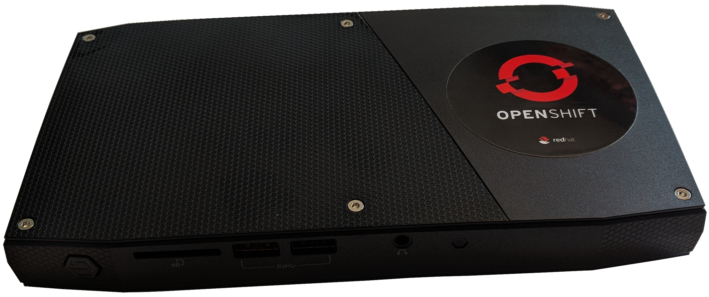

NB:  Offline install is still WIP

# ocp-on-nuc
## Why put OpenShift Container Platform on a NUC?
Well, why not?  But the compelling reason for me is that I need
more resources to run some of the expansive examples with OpenShift.
My Macbook is limited to 16 GB RAM so I don't have enough to allocate
to a minishift virtual machine.  I suppose I could host my demos in
the cloud but that isn't always feasible for me and I'm no fan of
the monthly bill.  This solution gives me a portable environment
to take anywhere to show off OCP features.  Plus it looks cool.

Use these instructions, adapted from [Grant Shipley's excellent
OpenShift Origin instructions](https://github.com/gshipley/installcentos),
to run OpenShift Container Platform on an Intel NUC.

## Get the Hardware
The specific hardware is an Intel NUC mini PC kit NUC6i7KYK (e.g.
Skull Canyon).

| Feature | Description |
| :-----: | ----------- |
| CPU | Intel 2.6 GHz 4-Core i7 6700HQ |
| Memory | Crucial 32GB DDR4 2133 |
| Graphics | Intel Iris Pro Graphics 580 |
| SSD | Samsung 850 EVO - 500GB |

## Install RHEL
Install RHEL 7.5 using the minimal package set.  Create the following
mount points on the disk.  The sizes are scaled for the 500 GB SSD.

* /boot with 2 GiB
* /boot/efi with 1 GiB
* / with 358 GiB
* swap with 4 GiB

This leaves just over 100 GiB for the docker-vg volume group which
will be created later.  Make sure to set the root password and also
create an unprivileged user (with sudo privileges).  In my
configuration, I also disabled the onboard WiFi interface.

## Enable Stable Networking
I want to make this portable to any site for demonstrations with
the ability to have a predictable IP address for the NUC.  To do
that, I purchased a small WiFi travel router to enable a LAN for
my NUC and my laptop and to provide a connection to the outside
world.  These [instructions](gl-inet-openwrt-config.md) describe
how I did that.

## Edit the Configuration
Edit the `install.conf` and update the parameters as necessary.  At
a minimum, you'll need to update `RHSM_USER` and `RHSM_PASS` to
match your credentials for the [Red Hat Customer
Portal](https://access.redhat.com).  Optionally, you can asign the
`POOL_ID` to match one of your entitlements.

## Prepare the Server
Run the following script as root to prepare the server for installs.
This script registers the system and creates the docker-vg volume
group.

    ./prep-server.sh

The system will reboot once this script completes.

## Install OpenShift
Run the following script as root to install the server.  This script
installs prerequisites, runs the install, and then creates a cluster
admin user as well as an unprivileged user.

    ./install-server.sh

Unless you changed the parameters in `install.conf`, the following
username/passwords are created:

* `admin/admin`
* `developer/developer`

## Create Persistent Volumes
Run the following script as root to create one hundred 10 GiB
persistent volumes.  The persistent volume directories are under
`/mnt/data`.

    ./create-pvs.sh

# Upgrade the Server
To upgrade to the latest version of OpenShift, follow the upgrade
instructions in the official docs.  As a help, three scripts are
provided, but always check to make sure they match the instuctions in
the OpenShift documentation.  Edit `install.conf` and make sure that
`VERSION` is correct.  Then run the script:

    ./upgrade-server.sh

Reboot the computer.  When the system is back up, run:

    ./upgrade-logging.sh
    ./upgrade-metrics.sh

