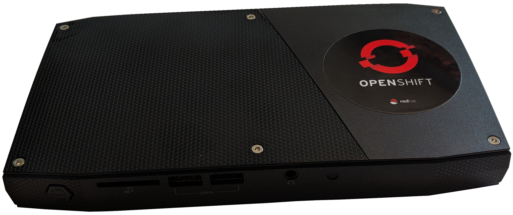

# ocp-on-nuc
## Why put OpenShift Container Platform on a NUC?
Well, why not?  But the compelling reason for me is that I need
more resources to run some of the expansive examples with OpenShift.
My Macbook is limited to 16 GB RAM so I don't have enough to allocate
to a minishift virtual machine.  I suppose I could host my demos in
the cloud but that isn't always feasible for me and I'm no fan of
the monthly bill.  This solution gives me a portable environment
to take anywhere to show off OCP features.  Plus it looks cool.

Use these instructions, adapted from [Grant Shipley's excellent
OpenShift Origin instructions](https://github.com/gshipley/installcentos),
to run OpenShift Container Platform on an Intel NUC.

## Get the Hardware
The specific hardware is an Intel NUC mini PC kit NUC6i7KYK (e.g.
Skull Canyon).

| Feature | Description |
| :-----: | ----------- |
| CPU | Intel 2.6 GHz 4-Core i7 6700HQ |
| Memory | Crucial 32GB DDR4 2133 |
| Graphics | Intel Iris Pro Graphics 580 |
| SSD | Samsung 850 EVO - 500GB |

## Install RHEL
Install RHEL 7.6 using the minimal package set.  Create the following
mount points on the disk.  The sizes are scaled for the 500 GB SSD.

* /boot with 2 GiB
* /boot/efi with 1 GiB
* / with 358 GiB
* swap with 4 GiB

This leaves just over 100 GiB for the docker-vg volume group which
will be created later.  Make sure to set the root password and also
create an unprivileged user (with sudo privileges).  In my
configuration, I also disabled the onboard WiFi interface.

NB: DO NOT SET THE HOSTNAME WHEN INSTALLING RHEL.  This can cause
name resolution issues for the internal docker registry that are
still being investigated.

## Enable Stable Networking
I want to make this portable to any site for demonstrations with
the ability to have a predictable IP address for the NUC.  To do
that, I purchased a small WiFi travel router to enable a LAN for
my NUC and my laptop and to provide a connection to the outside
world.  These [instructions](gl-inet-openwrt-config.md) describe
how I did that.

## Edit the Configuration
Edit the `install.conf` and update the parameters as necessary.  At
a minimum, you'll need to update `RHSM_USER` and `RHSM_PASS` to
match your credentials for the [Red Hat Customer
Portal](https://access.redhat.com).  Optionally, you can asign the
`POOL_ID` to match one of your entitlements.

With OCP 3.11, the [Red Hat container registry](https://registry.redhat.io)
now restricts pulling images to authenticated users.  To get your
credentials, go to the [Red Hat container registry](https://registry.redhat.io)
and click on the `Service Accounts` link in the center right of the
page.  Scroll until you find your account or click `New Service
Account` to create one.  Click on your service account.  Make sure
the `Token Information` tab is selected and copy your username and
password to the parameters `OREG_USER` and `OREG_PASS`, respectively,
in the `install.conf` file.  Make sure the username includes the
random number, the vertical bar, and the service account name.

## Prepare the Server
Run the following script as root to prepare the server for installs.
This script registers the system and creates the docker-vg volume
group.

    ./prep-server.sh

The system will reboot once this script completes.

## Install OpenShift
Run the following script as root to install the server.  This script
installs prerequisites, runs the install, and then creates a cluster
admin user as well as an unprivileged user.

    ./install-server.sh

Unless you changed the parameters in `install.conf`, the following
username/passwords are created:

* `admin/admin`
* `developer/developer`

## Create Persistent Volumes
Run the following script as root to create one hundred 10 GiB
persistent volumes.  The persistent volume directories are under
`/mnt/data`.

    ./create-pvs.sh

# Upgrade the Server
To upgrade to the latest version of OpenShift, follow the upgrade
instructions in the official docs.  As a help, three scripts are
provided, but always check to make sure they match the instuctions in
the OpenShift documentation.  Edit `install.conf` and make sure that
`VERSION` is correct.  Then run the script:

    ./upgrade-server.sh

Reboot the computer.  When the system is back up, run:

    ./upgrade-logging.sh
    ./upgrade-metrics.sh

# Notes on running disconnected
## Set up stable DNS name resolution
This will work with a VirtualBox VM on OSX.  In this configuration,
the host is providing stable DNS name resolution for the domain
`<FIXED IP>.nip.io`.  The parameter `<FIXED IP>` is whatever static
IP address was assigned to the OCP all-in-one instance.

Make sure that dnsmasq is running and there is a stable wildcard
resolution for `<FIXED IP>.nip.io`.  On OSX, you can use the resolver
facility by doing creating a file named `/etc/resolver/nip.io` with
the contents:

    domain nip.io
    nameserver 127.0.0.1

Then use brew to install and run dnsmasq.  First, install it using:

    brew install dnsmasq

Next, create the file `/usr/local/etc/dnsmasq.conf` with the contents:

    address=/.<FIXED IP>.nip.io/<FIXED IP>
    listen-address=127.0.0.1

Finally, start `dnsmasq` using:

    sudo brew services start dnsmasq

## Create the example project and application
This example must first be built with internet connectivity so that all the required images are pulled and added to the local docker registry.  With internet connectivity, do the following:

    oc new-app php~https://github.com/rlucente-se-jboss/phpmysqldemo.git --name myphp
    oc expose svc/myphp

Once the application is fully up and running, and possibly with an added database via the web console, you can then delete the project and application using:

    oc delete all --all -n demo
    oc delete project demo

Then remove the pre-built docker image using:

    ssh root@<FIXED IP>
    docker rmi -f $(docker images | grep myphp | awk '{print $3}')

Finally, on your host, get a local copy of the git repository:

    git clone https://github.com/rlucente-se-jboss/phpmysqldemo.git

## Recreate the image while running disconnected
With the internal docker registry now pre-populated, you can create the image using:

    cd /path/to/phpmysqldemo
    oc login -u developer -p developer console.<FIXED IP>.nip.io:8443
    oc new-project demo
    oc new-build --binary --image-stream php --name myphp
    oc start-build myphp --from-dir=.

When the build completes, issue:
    oc new-app myphp
    oc expose svc/myphp

To connect the application to the MySQL instance, use:
    oc set env dc/myphp MYSQL_SERVICE_HOST=mysql.demo.svc.cluster.local MYSQL_SERVICE_PORT=3306 MYSQL_SERVICE_DATABASE=myphp MYSQL_SERVICE_USERNAME=myphp MYSQL_SERVICE_PASSWORD=myphp

