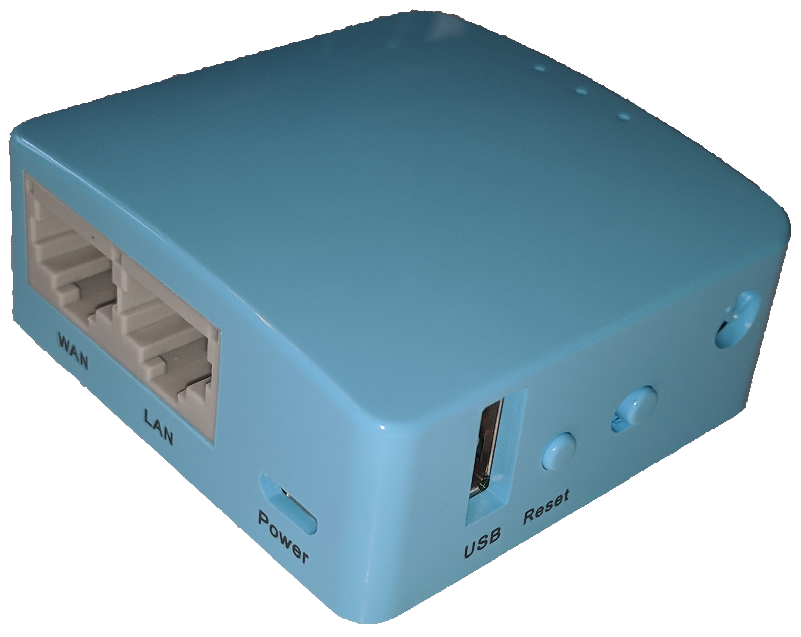

# Overview
I want to have a static IP address for my OCP instance regardless
of where I'm running it.  This makes it portable across multiple
demo environments.  My goal is to provide connectivity to the broader
public internet while enabling my laptop to easily connect to my
OCP instance since it has a static IP address.

To do this, I bought an inexpensive small travel wireless router,
the [GL.iNet MT300A](https://www.gl-inet.com/mt300a/).  NB: There
is a little switch on the side with no label that's set to the
right.  I don't know what this switch does, but setting it to the
right didn't prevent this from working.

These instructions use the travel router to create a small LAN for
both the NUC running OpenShift and my laptop while also providing
connection to the broader public internet.  To do this, the travel
router connects to the NUC via both an ethernet patch cable and a
USB cable for power.

The travel router provides two WiFi interfaces:  one acting as a
local access point (AP) or 'hotspot' and the other acting as a
station (STA) or 'client' to an external AP to reach the public
internet.

# Update the Router Firmware
Attach the travel router to your computer using an ethernet patch
cable and USB cable (for power).  The travel router ships with open
source firmware pre-installed which is really a good thing.  For
my purposes, I decided to reflash it to the latest available open
source firmware for maximum control.

First, make sure to backup your existing firmware in case this all
takes a hard left turn.  The included travel router instructions
cover powering it up, connecting to the default web interface,
http://192.168.8.1/, and logging in for the first time.  Go to the
appropriate web page to backup and update the current firmware.

Next, grab the latest firmware from the [OpenWRT upgrade
URL](http://downloads.lede-project.org/releases/17.01.4/targets/ramips/mt7620/lede-17.01.4-ramips-mt7620-gl-mt300a-squashfs-sysupgrade.bin).
The [Table of Hardware: Firmware
downloads](https://openwrt.org/toh/views/toh_fwdownload) page is
invaluable for finding the appropriate file for whatever device
you're using.  The latest firmware file for the MT300A was:

* lede-17.01.4-ramips-mt7620-gl-mt300a-squashfs-sysupgrade.bin

Use the firmware update page on the travel router web interface to
flash the firmware.  DO NOT DISCONNECT POWER WHILE DOING THIS!!!
The default IP address for the travel router will change so wait a
few minutes then refresh the DHCP lease on your computer to get an
updated IP address.

## Set Authentication Credentials
Log in via the default LuCI web interface, http://192.168.1.1/.
For login credentials, use `root` with no password.  In the web
interface, select `System` in the top row of tabs and `Administration`
in the second row.  Set the `root` password, set the Dropbear
interface to `lan`, and also add your public SSH key to enable
easier login via SSH.  Click the `Save & Apply` button at the bottom
of the web page.

# Configure WiFi Masquerading
Now, configure the travel router to provide a LAN using both the
LAN ethernet port and the WiFi interface while simultaneously
providing a wirless WAN connection as a WiFi client.

## Change the default IP Address
Set the LAN IP address to something that does not conflict with any
wireless network you may use.  It's a tall order but I selected
`10.123.123.0/24` with the router listening at `10.123.123.1`.  To
do this, change the IPv4 address field on the `Interfaces - LAN`
page at http://10.123.123.1/cgi-bin/luci/admin/network/network/lan
and then click `Save & Apply` at the bottom.

Once again, you'll need to refresh the DHCP lease on your laptop
to get your new IP address.

## Enable the WiFi
Go to the router's `Wireless Overview` page at
http://10.123.123.1/cgi-bin/luci/admin/network/wireless page to
enable the WiFi radio.

## Configure Masquerading
Follow these
[instructions](https://openwrt.org/docs/guide-user/network/wifi/ap_sta) to
configure the travel router as an A(ccess) P(oint or 'hotspot') +
STA(tion or 'client').  This is known as AP+STA mode.  I followed
steps 1 and 2, ignored step 3, and then followed optional step 4,
using the latest [wwanHotspot
release](https://github.com/jordi-pujol/wwanHotspot/releases).
You'll use the latest release with the [wwanHotspot
instructions](https://github.com/jordi-pujol/wwanHotspot).

# Set Stable Networking
To assign a static lease to a server on the LAN via DHCP, open the
LuCI web interface to the router and then select `Network -> DHCP
and DNS`.  At the bottom of that page, you'll see existing leases
and a form to add static leases.  Click the `Add` button.  When the
blank form appears, leave `Hostname` blank, set `MAC-Address` to
the server's ethernet inteface MAC, and set the desired static
`IPv4-Address`.  I determined the MAC address for the ethernet port
on the NUC and assigned it the static lease 10.123.123.10.  The MAC
addresses for the NUC's ethernet and WiFi interfaces are printed
on the bottom of the device.

# Using Alternative WiFi Networks
To connect to additional WiFi access points, simply add the ssid,
encryption method, and key for the WiFi access point to the to the
`/etc/config/wwanHotspot` configuration file on the travel router.
At power up, it will connect to the first WiFi access point it
finds.
